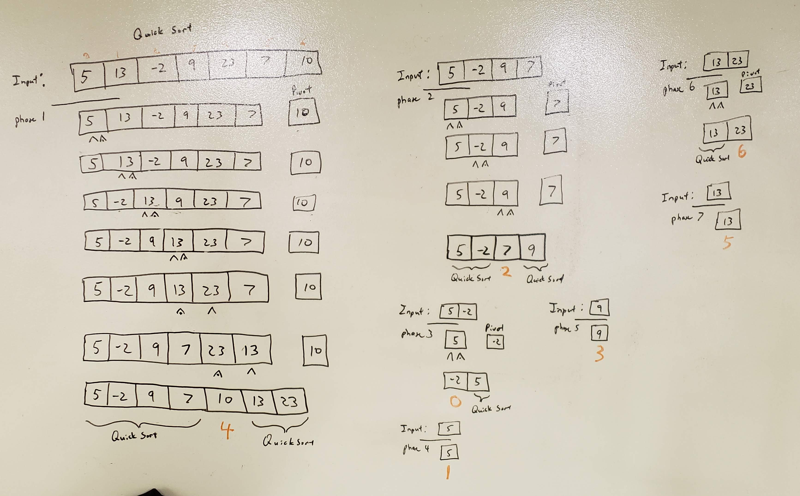

# Lecture Notes: Quick Sort

This sort is one of the more common sorts used in many built-in sorts. We should care because it is ubiquitous.

Quick Sort has the following performance profile:
* Time Complexity: `O(nlg(n))`
* Space Complexity: `O(lg(n))`

## Learning Objectives:
The student will learn the following:
* Quick sort algorithm
* Java implementation
* Unittests for the code
* Time and space complexity

## Lecture Flow:
Main Point:
 * Quick Sort is a recursive sort.
 * Quick Sort relies on a `pivot` element; There are several variations on selecting the `pivot`, but they all do the same thing. 
 * The elements in the array are arranged into two sides: less than or equal to the `pivot` and greater than the `pivot`.
 * The `pivot` is then swapped to the position between the two sides.
 * Quick Sort is then recursively called on the two sides excluding the `pivot`.
 * The key to understanding Quick Sort is to realize the element that is chosen as the `pivot` is ultimately moved to it's final position before Quick Sort is recursively called on the other two sides.

## Diagram


## Algorithm/Pseudocode
Gotten from Code Fellows 401:
```
ALGORITHM QuickSort(arr, left, right)
    if left < right
        // Partition the array by setting the position of the pivot value 
        DEFINE position <-- Partition(arr, left, right)
        // Sort the left
        QuickSort(arr, left, position - 1)
        // Sort the right
        QuickSort(arr, position + 1, right)

ALGORITHM Partition(arr, left, right)
    // set a pivot value as a point of reference
    DEFINE pivot <-- arr[right]
    // create a variable to track the largest index of numbers lower than the defined pivot
    DEFINE low <-- left - 1
    for i <- left to right do
        if arr[i] <= pivot
            low++
            Swap(arr, i, low)

     // place the value of the pivot location in the middle.
     // all numbers smaller than the pivot are on the left, larger on the right. 
     Swap(arr, right, low + 1)
    // return the pivot index point
     return low + 1

ALGORITHM Swap(arr, i, low)
    DEFINE temp;
    temp <-- arr[i]
    arr[i] <-- arr[low]
    arr[low] <-- temp
```

## Readings and References
Watch
* [Quick Sort in 4 Minutes](https://www.youtube.com/watch?v=Hoixgm4-P4M)

Read
* [Geeks for Geeks](https://www.geeksforgeeks.org/quick-sort/)
* [Tutorial Point](https://www.tutorialspoint.com/data_structures_algorithms/quick_sort_algorithm.htm)

Bookmark
* [Wiki Quick Sort](https://en.wikipedia.org/wiki/Quicksort
